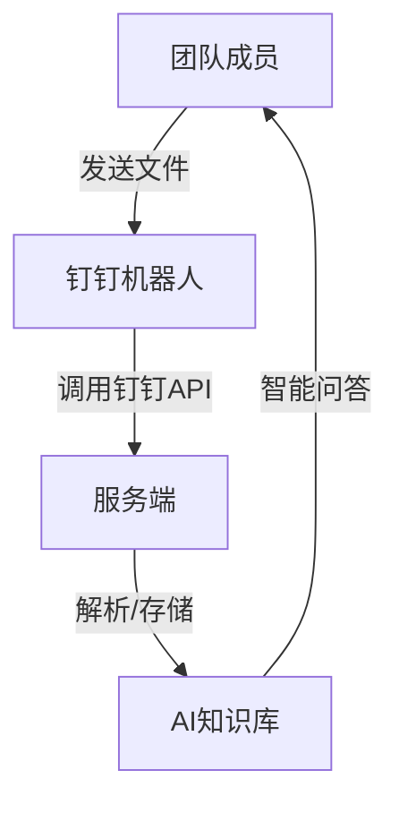

# 破晓方舟 植德极客大赛参赛方案设计说明

## 一、项目背景

本项目旨在打造一个智能知识库扩展方案，使团队成员能够通过钉钉平台，便捷地将文件上传至AI助理的知识库，持续提升知识管理的效能。

## 二、核心思路

### 1. 便捷的知识库扩展方式

本方案创新性地利用钉钉机器人，允许团队成员直接在钉钉程序中，通过与机器人对话的方式上传文件。团队成员无需切换平台或学习复杂操作，只需像日常聊天一样，将需要补充到知识库的文件发送给机器人即可。

### 2. 钉钉官方接口集成

项目充分利用钉钉官方提供的API接口，包括：
- 文件上传与管理接口：实现文件的安全上传和存储。
- 机器人消息接收接口：自动接收团队成员发送的文件消息。
- 审批与权限接口：确保文件上传、知识库更新等操作的合规性和安全性。

### 3. AI助理知识库自动更新

机器人收到文件后，自动将文件内容上传至AI助理的知识库。AI助理会定期或实时地对新知识进行解析、索引和训练，确保后续团队成员在咨询AI时能够获得最新、最全面的专业解答。

## 三、系统架构

- **团队成员**：通过钉钉与机器人交互，无需额外学习成本。
- **钉钉机器人**：作为消息中转和权限控制的核心，负责接收文件并与服务端通信。
- **服务端**：负责文件的解析、存储、权限校验，并将有效内容同步到AI知识库。
- **AI知识库**：不断扩展和更新，支撑AI助理的智能问答能力。

## 四、主要技术实现

1. **钉钉机器人开发**：
   - 注册并配置企业内部应用机器人，获取必要的`APPKEY`、`APPSECRET`、`ASSISTANT ID`等信息。
   - 配置消息接收、文件上传等权限。
2. **文件上传与处理**：
   - 利用钉钉API接收团队成员上传的文件。
   - 对文件内容进行解析、格式化处理。
3. **知识库自动扩展**：
   - 将解析后的内容自动同步到AI知识库。
   - 支持多种文件格式（如Word、PDF、图片OCR等）。
4. **安全与合规**：
   - 通过审批流、权限校验等机制，确保知识库内容的安全和合规。

## 五、用户体验亮点

- **极简操作**：团队成员只需在钉钉中发送文件，无需切换平台。
- **实时更新**：AI知识库可快速吸收新知识，提升AI助理的专业性。
- **安全合规**：全流程权限控制，保障律所数据安全。
- **可扩展性强**：支持多种文件类型和后续功能拓展。

## 六、应用场景举例

- 新法规、判例、合同模板等资料的快速补充。
- 行业动态、内部培训资料的集中管理。
- 律师日常工作中遇到的新问题、新知识的即时共享。

## 七、总结

本方案以钉钉为入口，极大降低了知识库扩展的门槛，结合AI助理实现了律所知识的高效积累与智能应用。